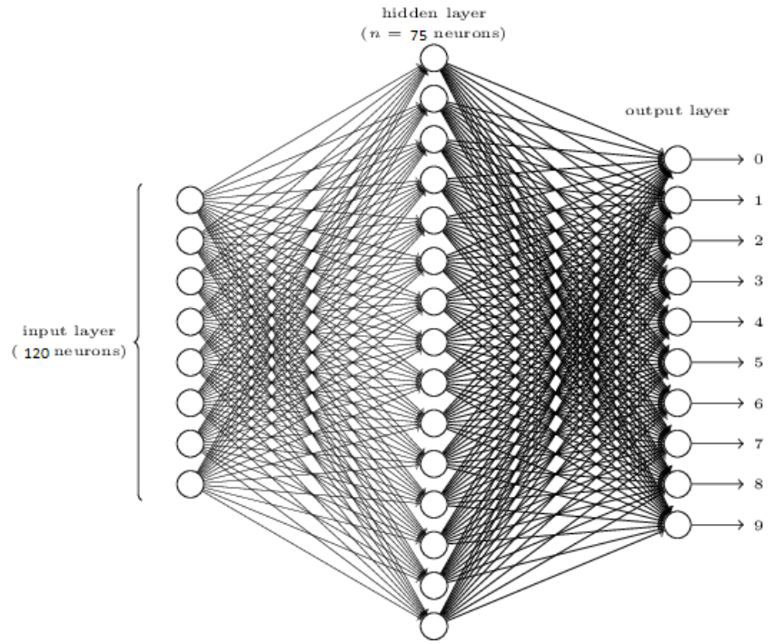
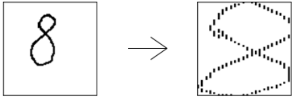
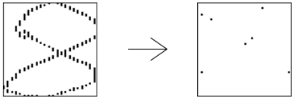

# Projekt: Rozpoznanie Cyfer Napisanych Długopisem Elektrycznym

Vitalij Syrotynskyi, Katrych Oleksandr

## Opis zadania i zbioru danych
Zbierano dane o cyferkach ręcznie pisanych przez 44 osoby (ok. 250 od każdej osoby). Cyferki pochodzące od 30 osób użyto do treningu, a cyferki pochodzące od 14 innych użytodo testu. Cyferki zostały pisane na specjalnym urządzeniu o rozdzielczości 500 × 500, pozwalającym zapamiętaćkolejne współrzędne (x, y) długopisu w 100-milisekundowych odstępach czasowych. Po zastosowaniu skalowania i normalizacji, współrzędne (x, y) przekształcono na wartości z przedziału [0; 100].

**Opis zbioru danych**

Nazwa pliku | Liczba rekordów  | Liczba atrybutów | Opis atrybutów |
------------|------------------|------------------|----------------|
pendigits.tra (Training)|7494| 16 input+1 class attribute |16 integer[0;100] 1 class attribute [0;9]|
pendigits.tes (Testing) |3498| 16 input+1 class attribute |16 integer[0;100] 1 class attribute [0;9]|

Klasa decyzyjna | Ilość przykładów w ‘training set’|
----------------|----------------------------------|
0               |780
1               |779
2               |780
3               |719
4               |780
5               |720
6               |720
7               |778
8               |719
9               |719

Klasa decyzyjna | Ilość przykładów w ‘testing set’  |
----------------|----------------------------------|
0               |363
1               |364
2               |364
3               |336
4               |364
5               |335
6               |336
7               |364
8               |336
9               |336

## Opis algorytmu, narzędzie programistyczne

Program napisany w jeżyku : `Java 8` 
Stosowano **algorytmu wstecznej propagacji błędu**. Jest to podstawowy algorytm uczenia nadzorowanego wielowarstwowych jednokierunkowych sieci neuronowych. Podaje on rzepis na zmianę wag  dowolnych połączeń elementów przetwarzających rozmieszczonych w sąsiednich warstwach sieci. Oparty jest on na minimalizacji sumy kwadratów błędów uczenia z wykorzystaniem optymalizacyjnej metody największego
spadku.

**Algorytm uczenia**
 
Krok 1: Wylosuj początkowe macierze wag `W, V` i początkowe wektory odchyleń `B, C`
 
Krok 2: Dla każdego wektora uczącego `X`
 
2.1 Wyznacz wektor wyjściowej z I warstwy (ukrytej) 

 
2.2 Wyznacz wektor wyjściowej z II warstwy (wyjściowej)

 
2.3 Wyznacz błędy neuronów
 
a) Warstwa wyjściowa: 

 
b) Warstwa ukryta:

 
2.2 Aktualizuj wagi `(dla i = 1,...,K)`
 
a) Warstwa wyjściowa: 

 

 
b) Warstwa ukryta:
 

 
 
Krok 3: Jeśli wagi pozostały bez zmian lub `E < E min` to stop, wpp. powrót do Krok 2

Do rozwiązania problemu było stosowano trzywarstwową sieć neuronową.
 
Wagi początkowe losowane w przedziałe `[-1;1]`. 
Przy testowaniu sieci było obrano **współczynnik uczenia** – `0.25`. 
**Liczba epok** – `30`.

## Przygotowanie danych do eksperymentu

**Dane eksperymentalne**, za pomocą jeżyka `Java`, były wczytane z pliku do macierzy : `double[][]` 
**Dane treningowe** było podzielono na 3 części. Pierwsza polowa dla uczenia sieci. Jedna czwarta dla walidacji. Jedna czwarta dla testów uzależnionych od pisarzy. Dane testowę zostały wykorzystane do testowania sieci i oceniania jakości modelu. 

## Metoda oceniania jakości modelu

 
W końcowym wyniku udało się zdobyć **95%** poprawności sieci na danych testowych.

## Wyniki eksperymentalne
W trakcie pracy nad algorytmem najpierw było stosowano sieci dwuwarstwowej, ale wyniki testowania nie przekracały **55-65%** poprawności.  
Dalej było zaimplementowano trzywarstwową sieć i wyniku zmieniania neuronów na 1 i 2 warstwie, liczb epok i współczynnika uczenia udało się zdobyć **95%** poprawności sieci na danych testowych.  

## Algorytm wczytywania namalowanej(w naszym programie) cyfry
Przestrzeń dla rysowania `PaintArea` zrobiona za pomocą `JPanel`, nie jest bardzo fajnym narzędziem do rysowania (jeśli za szybko rysować to cyfry nie będzie widać), ale dla naszego eksperymetu tego jest wystarczająco. Został dodany nowy `MouseMotionListener` i teraz kiedy przeciskamy i poruszamy myszką to się wywoła metoda `mouseDragged(MouseEvent e)`, w niej zapisujemy pozycję myszki w wektor współrzędnych (x, y) w naszym przypadku to `ArrayList<Pair<Integer, Integer>> digitVector` i równocześnie rysujemy na wykresie. Kiedy zakończymy przesuwać myszką wywoła się metoda `mouseReleased(MouseEvent e)` w której wywołamy metodę `Tools.compressVector(digitVector)` i otrzymujemy zkompresowany vektor (8 par współrzędnych (x, y)).
## Algorytm kompresowania wektora namalowanej (w naszym programie) cyfry
Algorytm jest wykonany w metodzie `Tools.compressVector(digitVector)`. Najpierw otrzymane współrzędne (x, y) potrebno rozszerzyć tak, żeby cyfra mieściła się na krajach macierzy 100x100 (uczenie sieci wykonane na podobnych cyfrach). 
Przykład : 

Następnie potrzebnym jest zmniejszenie liczby współrzędnych (x, y) do ośmiu (takie cyfry były wykorzystane dla uczenia sieci). 
Najpierw liczymy długość między wszyskimi współrzędnymi (x, y) za pomocą wzoru  
, który został zaimplementowany w metodzie `calcDigitLength(Vector)`. Dalej dzielimy otrzymaną długość na 7 równych odcinków (7 poniważ ósmy to jest pierwzy punkt), otrzymujemy długość `X`. Szukamy 8 punktów (współrzędnych) ze długością między nimi równej `X`. 
Przykład : 

## Własne komentarze, wnioski. 
Oprócz samego algorytmu uczenia sieci i testowania jej na danych testowych było zaimplementowano okno dla wprowadzenia (rysowania) liczb za pomocą myszki komputerowej. Algorytm stosowany dla wybrania 16 atrybutów opisany powyżej.

